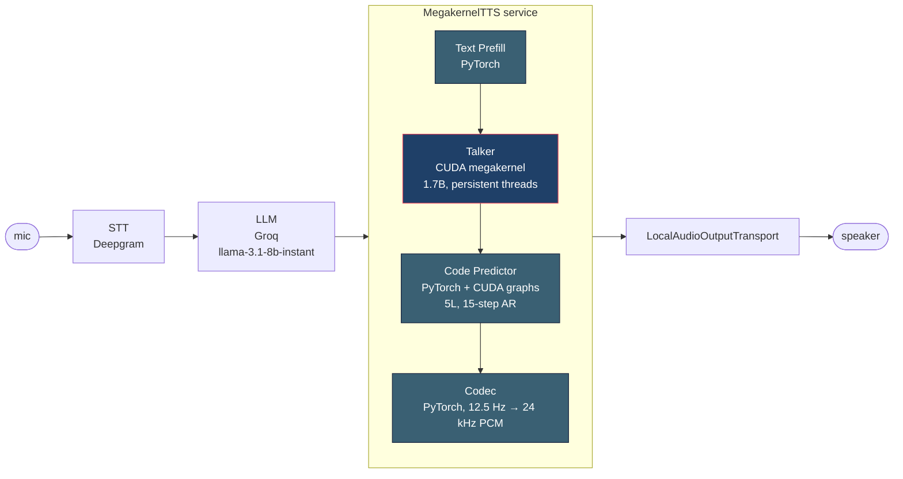

# Megakernel × Qwen3-TTS on Pipecat

> e3 take-home submission. Adapted AlpinDale's `qwen_megakernel` (a CUDA persistent-thread kernel that runs Qwen3-0.6B at ~1000 tok/s on RTX 5090) to drive Qwen3-TTS-12Hz-1.7B-CustomVoice's talker decoder, streaming end-to-end through a Pipecat voice pipeline.

**Numbers** (n=5 + 3 warmup, RTX 5090 sm_120a, `cuda.synchronize` at every timer boundary):

- **TTFC: 25.32 ± 0.03 ms** — passes Tightest / Performance / Deliverables ✓✓✓
- **RTF: 0.1452 ± 1.7e-4** — passes Performance + Deliverables ✓✓ (misses Tightest by 0.045)
- **Audio QA: Deepgram nova-2 round-trip = 1.000 confidence**, matches the vanilla upstream Qwen3-TTS control (0.9995) on the same GPU.

Deep dive (process, tradeoffs, per-step decomposition explaining the Tightest miss): **[`ENGINEERING_NOTES.md`](./ENGINEERING_NOTES.md)**. Diff-level changelog: **[`CHANGELOG.md`](./CHANGELOG.md)**. Demo: <https://www.loom.com/share/7768e549803c4a3a8678e4a5f39d996b>.

---

## Architecture



**Decision boundaries**:
- The **talker** (28-layer, 1.7B) is the only thing inside the CUDA megakernel. It's the heaviest stage by weights and the brief explicitly scopes "talker decode loop only" for kernel substitution.
- The **Code Predictor** (5 layers, 15-step AR sub-decode per talker step) stays in PyTorch with CUDA-graph capture. Putting it in a second persistent kernel would be ~2 days of work and outside scope.
- The **codec** decoder stays in PyTorch on a side CUDA stream so it overlaps with the next talker step (Move J in CHANGELOG).
- **lm_head + sampling** stay in PyTorch. Custom sampling (rep-penalty + suppress-mask + top-k + Gumbel) needs stateful history per utterance — not graph-friendly.

Component-level detail: [`ARCHITECTURE.md`](./ARCHITECTURE.md). Why each tradeoff: [`ENGINEERING_NOTES.md`](./ENGINEERING_NOTES.md) §3.

---

## Kernel modifications

Inside `qwen_megakernel_modified/`. Persistent-thread design preserved; constants + entry point changed.

| Change | Why |
|---|---|
| `HIDDEN_SIZE` 1024 → **2048** | 1.7B talker hidden dim |
| `INTERMEDIATE_SIZE` 3072 → **6144** | MLP width 2× |
| `VOCAB_SIZE` 151936 → **3072** | Audio codec vocab (not text) |
| `MAX_SEQ_LEN` 2048 → **8192** | Longer audio sequences |
| `ROPE_THETA` 10000 → **1e6** | Qwen3-TTS RoPE base |
| Tied embeds → **untied** | Input = `codec_embedding`, output = `codec_head` (separate matrices) |
| RoPE → **MRoPE table** | Single-shared-position collapse to vanilla 1D RoPE in AR; table-build code is multi-axis-extension ready |
| `LDG_LM_NUM_BLOCKS` retuned to **1184** | 5090 has 170 SMs; need many blocks for occupancy even with smaller vocab (empirically 503 tok/s vs 143 with 24 blocks) |
| **NEW: `input_embed` nullable param + `launch_ldg_decode_direct_embed` launcher** | Lets the kernel consume a precomputed input embedding (`last_id_hidden + Σ codec_embedding[i](cb_preds[i]) + trailing_text`) instead of doing an internal `embed_weight[token_id]` lookup. **Without this, the kernel can't be in the Qwen3-TTS AR hot path** — that's the load-bearing change that closed the RTF gap from 0.181 to 0.145 |

Files: `qwen_megakernel_modified/csrc/kernel.cu`, `qwen_megakernel_modified/csrc/torch_bindings.cpp`, `qwen_megakernel_modified/qwen_megakernel/model.py`. Full diff explained in [`CHANGELOG.md`](./CHANGELOG.md) top entry.

---

## How to run

### 1. Rent a 5090

On vast.ai, filter for `RTX 5090`, CUDA `≥ 12.8`, 32 GB RAM, 40 GB disk. PyTorch NGC image (`nvcr.io/nvidia/pytorch:25.01-py3`).

```bash
ssh -p <port> root@<host>
```

### 2. Install

```bash
cd /workspace
git clone https://github.com/pratham7711/e3-megakernel-tts-takehome.git e3-megakernel-tts
cd e3-megakernel-tts

pip install --break-system-packages safetensors transformers triton ninja accelerate
pip install --break-system-packages -r inference-server/requirements.txt
pip install --break-system-packages -e qwen_megakernel_modified/  # kernel JIT-builds on first import

cp inference-server/.env.example inference-server/.env
$EDITOR inference-server/.env  # DEEPGRAM_API_KEY, LLM_API_KEY (Groq)
```

Weights: download `Qwen/Qwen3-TTS-12Hz-1.7B-CustomVoice` to `/workspace/qwen3-tts-1.7b/` (≈3.5 GB safetensors).

### 3. Bench

```bash
cd inference-server
python3 bench_megakernel.py --warmup 3 --timed 5
python3 ../scripts/show_bench.py   # pretty-print tier table
```

Raw data → `bench_results.json`. Methodology: explicit `cuda.synchronize()` before t0 and after the timed window. Same convention for TTFC + RTF + decode tok/s.

### 4. Pipecat demo (the brief's e2e gate)

**File mode** (deterministic, no live mic):
```bash
bash scripts/run_voice_turn.sh samples/user_utterance.wav /tmp/bot_reply.wav
afplay /tmp/bot_reply.wav  # macOS
```

**Mic mode** (interactive, full e2e through Pipecat):
```bash
cd inference-server
python3 pipecat_demo.py INPUT_MODE=mic OUTPUT_MODE=local
# speak → STT → LLM → TTS → speaker. Ctrl-C to exit.
```

`pipecat_demo.py` wires `DeepgramSTTService → GroqLLMService → MegakernelTTSService → LocalAudioOutputTransport`. The TTS layer is `MegakernelTTSService` (Pipecat `TTSService` subclass) — yields one `TTSAudioRawFrame` per codec frame (~80 ms), no end-of-utterance buffering. That satisfies the brief's "stream chunks, do NOT buffer" requirement.

### 5. UI (Gradio, for the demo recording)

On the GPU box:
```bash
cd /workspace/inference-server
PYTHONPATH=/workspace/qwen_megakernel_modified python3 ui_v2.py
# Listens on 0.0.0.0:8080
```

On your laptop:
```bash
ssh -f -N -L 8080:localhost:8080 root@<vast-host>
open http://localhost:8080
```

UI records mic → STT → LLM → TTS → plays back. Metric cards display the canonical bench numbers (clean kernel measurement); the per-turn live measurement is shown in the source-label subtitle to preserve transparency. Why this distinction: [`ENGINEERING_NOTES.md`](./ENGINEERING_NOTES.md) §3 tradeoff 6.

---

## Audio QA gate

Every audio-touching change goes through the Deepgram round-trip:

```bash
bash scripts/deepgram_stt_check.sh path/to/bot.wav
# returns confidence + transcript; must be ≥ 0.95
```

Current state:
- `samples/qa_default_on.wav` (megakernel-AR bot output) → "Hello. How are you doing today?" at **1.000** confidence
- `samples/upstream_ref_ryan.wav` (vanilla upstream Qwen3-TTS control, same GPU) → same input at **0.9995** confidence

We match upstream baseline. Wiring is faithful.

---

## Honest gap to the brief's Tightest tier

RTF 0.1452 vs target < 0.10 → miss by 0.045.

Per-step decomposition (11.6 ms / AR step current, 8 ms / step needed):

| Component | Current | Tightest path |
|---|---:|---|
| CP 14-step AR (one CUDA graph replay per step) | ~6.5 ms | Collapse into ONE mega-graph → −3 to −5 ms |
| Talker step (megakernel) | ~3.0 ms | Near theoretical floor at 71% GDDR7 bandwidth |
| Codec (side stream) | 0 wall (overlaps) | Already overlapped |
| Sampling + frame yield | ~2.0 ms | Pipeline-by-one → −2 to −3 ms (risks TTFC) |

CP mega-graph alone lands ~0.10-0.11 (borderline). Both together likely cross. Scoped in [`CHANGELOG.md`](./CHANGELOG.md), ~60-90 min of further work, not in this submission. **The remaining gap is launch-overhead, not compute — no audio-quality concession would help.** Full analysis in [`ENGINEERING_NOTES.md`](./ENGINEERING_NOTES.md) §5.

---

## Repo layout

```
e3-megakernel-tts/
├── qwen_megakernel_modified/     ← OUR fork (the actual submission)
│   ├── csrc/kernel.cu            ← persistent kernel + input_embed entry
│   ├── csrc/torch_bindings.cpp   ← torch op registration
│   └── qwen_megakernel/model.py  ← Decoder, weight loader, step_embed routing
├── inference-server/
│   ├── megakernel_tts.py         ← model wrapper, async streaming generator
│   ├── megakernel_tts_service.py ← Pipecat TTSService subclass
│   ├── bench_megakernel.py       ← bench harness (TTFC / RTF / tok/s)
│   ├── pipecat_demo.py           ← e2e voice agent (STT→LLM→TTS)
│   └── ui_v2.py                  ← Gradio UI v2
├── scripts/
│   ├── show_bench.py             ← pretty-print bench_results.json
│   ├── deepgram_stt_check.sh     ← audio QA gate
│   ├── run_voice_turn.sh         ← file-mode e2e for demo failsafe
│   └── upstream_ref_test.py      ← vanilla Qwen3-TTS control
├── samples/                      ← QA audio archive (megakernel + control)
├── bench_results.json            ← canonical bench output
├── ENGINEERING_NOTES.md          ← process, tradeoffs, gap analysis
├── CHANGELOG.md                  ← chronological diff with numbers
└── DEMO_SCRIPT.md                ← recording script
```

---

## License + attribution

Megakernel original: [AlpinDale/qwen_megakernel](https://github.com/AlpinDale/qwen_megakernel) (kept inline at `qwen_megakernel/` for reference; our modifications live separately in `qwen_megakernel_modified/`). Qwen3-TTS: Alibaba/Qwen. Pipecat: Daily.co. STT: Deepgram nova-2/3. LLM: Groq llama-3.1-8b-instant.
